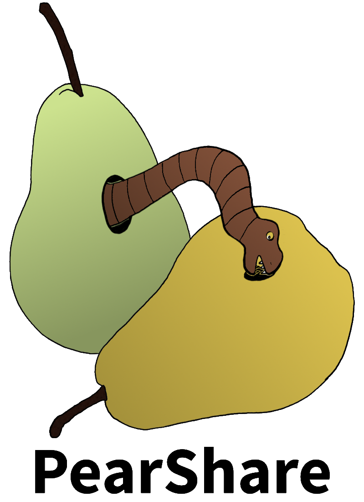

# web-2.0  
Repository für das Web 2.0 Projekt der Gruppe 3



## Setup

1. Check out the modified [PeerJS repopository](https://github.com/robert461/peerjs).
2. Run ```npm run``` and ```npm build``` (You have to install NodeJS on your machine).
3. Check out the modified [PeerJS-Server repopository](https://github.com/robert461/peerjs-server).
4. Run ```docker build``` and ```docker run``` with appropriate arguments (Docker is required).
5. Check out this repository.
6. Add the peerjs.min.js you built in step 2 into the assets folder.
7. Set the address of the docker container you deployed in step 4 in the index.js file.
8. Open the index.html file.
